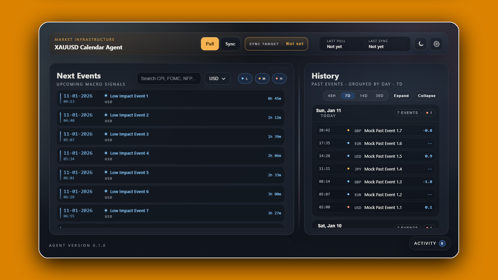

<h1 align="center">XAUUSD calendar agent</h1>

A Windows desktop application for tracking and visualizing economic events.

## Quick Start (Windows)

### Prerequisites
- Windows 10 or later
- Data source with properly formatted economic calendar JSON files
  
### Installation
1. Navigate to the [Releases](https://github.com/yiyousiow000814/xauusd-news-information-and-predictions/releases) page.
2. Download `Setup.exe`.
3. Run the installer.
4. Follow the installation wizard prompts.
5. Launch `XAUUSD Calendar Agent` from the Start menu or desktop shortcut.

## Uninstall (Windows)
- Uninstall from Windows “Apps & features” / “Installed apps”.

## Docs & FAQ
- [Getting Started](docs/getting-started.md)
- [Calendar Utilities](scripts/calendar/README.md#calendar-utilities)
- [News collection & analysis](scripts/news/README.md)

## License
Personal, non-commercial research use by Individuals only. No redistribution and
no public sharing/promotion. See [LICENSE](LICENSE).

## Usage Notice
> [!IMPORTANT]
> - **Educational / research use only.** This repository and its releases (including EXE builds) are provided for educational and research purposes only.
>
> - **No data or keys included.** We do not include or distribute any data sources, feeds, endpoints, or API keys. You must configure and use your own legally accessible data sources.
>
> - **Compliance required.** You are solely responsible for ensuring your use complies with applicable laws and regulations, and any third-party terms (including website Terms of Service and data provider terms).
>
> - **No bypassing restrictions.** Do not use this project to bypass access controls, rate limits, paywalls, or other restrictions.
>
> - **No advice.** This project provides technical and implementation examples only. Any information produced by this software is for reference only and does not constitute legal, financial, trading, or investment advice. Consult qualified professionals before making decisions.
>
> - **Use at your own risk.** The author assumes no responsibility for how the project is used.
