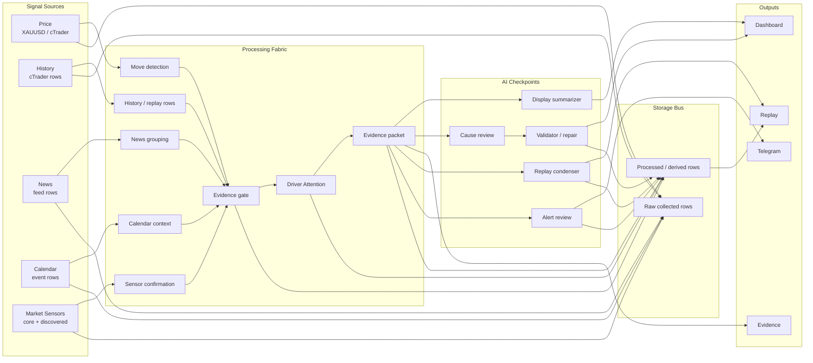

# Market Agent Activity Signal Map Design

## Objective

Redesign the Market Agent Activity page as a readable signal map. The page must show how each market signal is collected, processed, optionally reviewed by AI, persisted, and delivered to Dashboard, Evidence, Replay, or Telegram. It must avoid a single linear pipeline because the agent has multiple inputs, multiple processing lanes, and multiple output paths.

## Design Principles

- Show the system as a circuit board / signal bus, not as stacked cards.
- Keep the default view sparse: nodes, lanes, status lights, and short current action text.
- Put detail behind interaction. Selecting a node opens a detail drawer instead of expanding all content in the page.
- Make Storage visible as a first-class layer so replay and historical audit are understandable.
- Make AI participation explicit at the exact checkpoint where it acts, with fallback status visible.
- Treat Market Sensors as both a fixed core watchlist and an expandable discovery surface.

## Default Layout

The default screen uses four horizontal bands:

1. **Signal Sources**
   - Price: XAUUSD live quote from cTrader.
   - History: cTrader historical rows and backfill.
   - News: app-managed feed rows.
   - Calendar: economic calendar rows.
   - Market Sensors: core and discovered cross-market signals.

2. **Processing Fabric**
   - Move detection.
   - History gap / replay row preparation.
   - News grouping.
   - Calendar context.
   - Sensor confirmation.
   - Evidence gate.
   - Driver Attention.
   - Evidence packet.

3. **AI Checkpoints**
   - Display summarizer for Latest Evidence short summaries.
   - Cause review for candidate driver reasoning.
   - Validator / repair for LLM JSON and driver constraints.
   - Replay condenser for day-to-month important event summaries.
   - Alert review for Telegram-ready messages.

4. **Storage and Outputs**
   - Storage Bus in the lower middle, connected from both raw and processed lanes.
   - Outputs on the right: Dashboard, Latest Evidence, Replay, Telegram.

The visual shape is a multi-lane circuit:



## Node Model

Each node shows only compact status in the map:

- label
- status light: live, working, stale, unavailable, gated, AI, stored, alert
- current action: fetching, grouping, confirming, summarizing, validating, storing, delivering
- input count or source name
- output target badge

Example compact node:

```text
DXY
live
Confirming USD pressure
Yahoo proxy -> Evidence gate
```

Selecting a node opens the detail drawer.

## Detail Drawer

The detail drawer is the main way to inspect the system without crowding the page. It contains:

- **What this is**: plain-language role, such as "USD pressure sensor".
- **Where it comes from**: provider, fallback path, source symbol, timestamp.
- **What is happening now**: fetching, stale check, confirmation, summarization, validation, storage.
- **Inputs**: raw row fields or upstream node names.
- **Processing**: exact rule/AI stage applied.
- **AI involvement**: none, display summary, cause review, validator, replay condenser, or alert review.
- **Outputs**: downstream nodes and UI surfaces.
- **Storage**: table names and whether the row is raw collected data or processed derived data.
- **Trace**: a mini path from source to current outputs.

The drawer defaults to a readable summary. A raw JSON/payload toggle is available for debugging.

## Storage Bus

Storage must be visually central because it explains historical replay and auditability.

**Raw collected rows**

- `market_price_bars`
- `related_asset_bars`
- `news_items`
- `calendar_events`
- `provider_health`

**Processed / derived rows**

- `evidence_packets`
- `analysis_results`
- `driver_attention_states`
- `timeline_events`
- `month_summary_events` as replay payload output derived from timeline events
- `state_transitions`
- `alerts`

The Storage Bus node must answer:

- what has been persisted for this run
- whether the persisted row is raw or derived
- which table can answer a one-month-old replay question
- which UI surface reads it
- whether AI-produced short summaries are stored in row payloads or only displayed temporarily

## Market Sensors

The page must not imply that all possible causes are known ahead of time. Market Sensors are split into three groups.

### Core Sensors

These are stable, always-watched general sensors because they often affect XAUUSD:

- USD pressure: DXY
- Rates / yields: US10Y, US2Y
- Oil / inflation: WTI, Brent
- Risk sentiment: VIX, S&P 500, Nasdaq

The current code reads replay series for `dxy`, `us10y`, `us2y`, `wti`, `brent`, `vix`, `spx`, and `nasdaq`. Provider symbols include Yahoo-style proxies such as `DX-Y.NYB`, `^TNX`, `CL=F`, `BZ=F`, `^VIX`, `^GSPC`, and `^IXIC`, with CSV fallback when configured.

### Candidate Sensors

Candidate sensors are not always monitored as first-class rows. They are requested or highlighted when context suggests a new possible driver:

- a news theme asks for a sensor, such as shipping, banking stress, tariff, war risk, credit, liquidity, or fiscal stress
- Driver Attention links a theme to needed confirmation
- the evidence gate records missing or unavailable confirmation
- AI cause review or alert review flags a plausible but unsupported driver

Candidate sensor cards show:

- requested by: news grouping, Driver Attention, evidence gate, or AI review
- why requested: short reason
- current coverage: watched, proxy available, unavailable, or needs provider mapping
- downstream effect: blocks cause claim, lowers confidence, or remains background

### Discovered Sensors

Discovered sensors represent "we do not know this yet, but the system noticed a gap." They are visible product states for future provider expansion, not fake data. A discovered sensor can appear when repeated evidence points to a driver that has no current sensor mapping.

Examples:

- geopolitical risk proxy requested by repeated war headlines
- credit stress proxy requested by banking stress headlines
- shipping / supply proxy requested by supply shock headlines
- liquidity proxy requested by cross-market stress without a direct source

The UI must mark discovered sensors as "not monitored yet" rather than pretending the data exists.

## Trace Interaction

The Activity page should support "trace one thing" interaction.

Examples:

- Selecting `DXY` highlights:
  `Market Sensors -> Sensor confirmation -> Evidence gate -> Driver Attention -> Evidence packet -> Latest Evidence / Replay -> related_asset_bars`

- Selecting `News` highlights:
  `News source -> News grouping -> Evidence gate -> Display summarizer -> Dashboard / Latest Evidence -> news_items`

- Selecting `Month Replay` highlights:
  `timeline_events -> Replay condenser / important-event filter -> month_summary_events -> Replay UI`

- Selecting `Cause Review` highlights:
  `Evidence packet -> Local AI cause review -> Validator / repair -> analysis_results -> Dashboard`

Non-selected lanes fade but remain visible so the user keeps system context.

## Current Work Status Indicators

Each stage must show what is being done now:

- fetching
- waiting
- stale check
- normalizing
- grouping
- confirming
- blocked
- summarized
- validating
- repaired
- stored
- delivered

These statuses should come from current `monitorStatus.activity` where available, with fallbacks derived from replay payload counts and provider health.

## Visual Direction

- Industrial control panel, not a landing page.
- Thin circuit traces and small status lights.
- Dense but not crowded.
- No nested cards.
- Detail drawer for depth.
- Storage Bus uses a horizontal rail to show persistence.
- AI nodes use a distinct but restrained treatment, such as a small "AI" chip and amber/blue trace line.
- Core sensors and candidate/discovered sensors use different line styles:
  - solid: actively monitored core sensor
  - dashed: candidate sensor
  - dotted: discovered but unmapped sensor

## Component Boundaries

Proposed focused components:

- `MarketAgentSignalMap`: top-level Activity replacement.
- `SignalLane`: renders source lane and lane-local nodes.
- `SignalNode`: compact node button with status and action.
- `SignalTrace`: draws / styles selected path links.
- `SignalDetailDrawer`: selected node details and raw toggle.
- `StorageBus`: raw and derived persistence rail.
- `MarketSensorPanel`: core, candidate, and discovered sensors.

The current `MarketAgentActivity.tsx` is already large enough that implementation should split new map logic into focused files rather than expanding a single component further.

## Data Requirements

Use existing data first:

- `monitorStatus.activity`
- `providerHealth`
- `replay.replay.related_assets`
- `replay.replay.timeline_events`
- `replay.replay.month_summary_events`
- `selectedEvidence.payload.evidence_packet`
- `selectedEvidence.timeline_store_path`
- Local AI config and Telegram config

If the backend lacks explicit candidate/discovered sensor metadata, the UI can infer initial candidate sensors from:

- `driver_attention_states.linked_assets`
- `evidence_packet.allowed_candidate_drivers`
- `evidence_packet.blocked_drivers`
- `evidence_packet.cross_asset_confirmation`
- news/category keywords already used by Driver Attention
- unavailable/stale provider health rows

Future backend improvement: add a `sensor_requests` or `market_sensor_registry` object to activity status so candidate/discovered sensors are explicit and auditable.

## Testing

Add focused UI tests for:

- Activity page renders as a signal map, not a card list.
- Storage Bus shows raw and derived table groups.
- Market Sensors show core sensors: DXY, US10Y, US2Y, WTI, Brent, VIX, S&P 500, Nasdaq.
- Candidate/discovered sensor state can be displayed when evidence mentions an unsupported driver.
- Selecting a node opens detail drawer with input, processing, output, storage, and AI sections.
- Trace mode highlights only the selected path while preserving the full map context.

Run the standard verification after implementation:

- `npm --prefix app/webui run test`
- `npm --prefix app/webui run build`
- `npm run ui:check`
- random review of 5 Light/Dark ui-check screenshots
